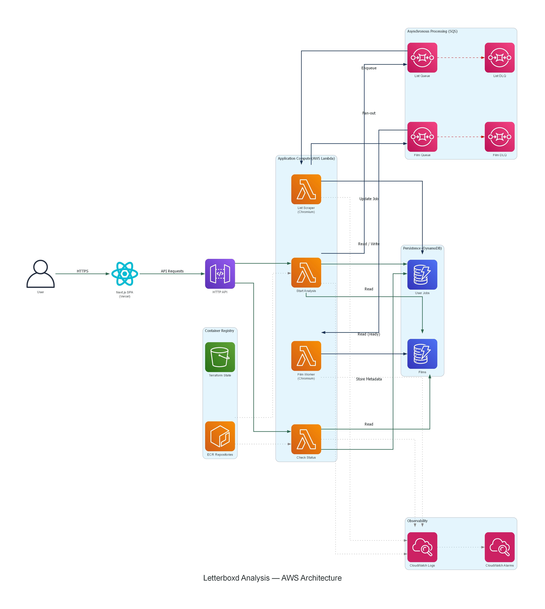

# The Ultimate Letterboxd Analysis 🍿

> *A gamified web experience that turns your movie taste into playable insights.*

## Why I Built This

I've always been drawn to products that analyze user behavior and turn data into something engaging and personal.

Most tools present insights as static charts. I wanted to explore a different direction: **What if your data was something you could play with?**

Letterboxd already contains incredibly rich data — ratings, genres, themes, cast, countries — but lacks a deeply interactive insight layer. So I set out to build what I envisioned as a fully gamified, end-to-end analysis system for it.

---

## What It Does

Enter a Letterboxd username → the app scrapes the user's entire watch history → and progressively unlocks six interactive games.

Instead of overwhelming the user with dashboards, each insight is revealed through gameplay:

| Game                  | Description                                                                                 |
| --------------------- | ------------------------------------------------------------------------------------------- |
| **Rating Intuition**  | Guess your own rating for films from your history                                           |
| **Genre Ranking**     | Rank your most-watched genres against the real order                                        |
| **Genre Matching**    | Match movies to their correct genre                                                         |
| **Theme Guessing**    | Identify recurring themes in your taste                                                     |
| **Taste Positioning** | Discover where you fall on mainstream ↔ niche and convergent ↔ divergent axes               |
| **Viewing Habits**    | Guess your favorite actor, identify your real duration chart, explore your global watch map |

After completing all games, the system generates a **Cinematic Identity** — a high-fidelity recap card including:

- Scores and performance
- Taste persona
- "Guilty pleasures" and "hot takes"
- Top actors and countries

Exportable as a shareable PNG.

---

## Architecture

| Layer         | Stack                                                             |
| ------------- | ----------------------------------------------------------------- |
| **Frontend**  | Next.js 16, React 19, Tailwind CSS, Framer Motion, Zustand, D3.js |
| **Compute**   | AWS Lambda (Container Image, ARM64), Playwright + Chromium        |
| **Messaging** | Amazon SQS + Dead Letter Queues                                   |
| **Database**  | Amazon DynamoDB (PAY_PER_REQUEST, TTL, SSE)                       |
| **IaC**       | Terraform + Terragrunt (9 modules)                                |
| **CI/CD**     | GitHub Actions (OIDC, selective matrix builds, E2E verification)  |

---

## Technical Highlights

### Event-Driven Scraping Pipeline

Scraping is inherently slow, so the API immediately returns `202 Accepted` and dispatches work via SQS. A list scraper discovers all films, then fans out work to concurrent workers.

This allows users to start interacting with the product before data collection finishes, turning waiting time into active engagement.

### Progressive Experience (Partial Data Gameplay)

Users can begin playing the Rating game with as few as 5 films while the rest of the dataset is still being processed.

This required coordinating polling, state hydration, and per-game stores to ensure consistency without blocking the experience.

### Self-Healing System Design

The system automatically detects and resolves:

- **Stuck jobs** — stale processing states older than 3 minutes
- **Data inconsistencies** — missing film metadata below expected thresholds
- **Race conditions** — concurrent writes handled via DynamoDB conditional expressions

No manual intervention needed.

### Idempotent & Fault-Tolerant Workers

Each scraping worker uses DynamoDB conditional writes and TTL to guarantee idempotency and avoid duplicate processing in a distributed system.

### Security & Cost Protection

Every analysis request passes through a three-layer middleware stack:

1. **Kill-Switch** — An SSM Parameter Store flag that can disable the scraper instantly, triggered automatically by budget alerts
2. **JWT Auth** — Short-lived, IP-bound tokens prevent bots from exhausting resources
3. **Tiered Quotas** — Per-IP (5/day) and global (100/day) caps enforced at the DynamoDB level

An AWS Budget at $15/month triggers an SNS → Lambda chain that flips the kill-switch automatically.

### Selective CI/CD Pipeline

- Only modified Lambda functions are rebuilt and deployed using `dorny/paths-filter`.
- OIDC authentication removes the need for stored AWS credentials.
- Each deployment is validated with live end-to-end tests.

### Custom Dialogue Engine

A logic-based system controls text reveal timing:

- Nonlinear scaling based on length
- Punctuation-aware pauses
- Emotion-based modifiers

This creates a more natural, narrative-driven interaction layer.

### Design System

A custom "Natural" design language built from scratch:

- Serif typography
- Warm color palette
- Grain textures and organic shapes
- Strict color constraints

Documented and enforced across the entire application.

---

## Challenges

### Gamification Balance

Designing scoring systems that reward genuine self-awareness — without favoring extreme users (e.g. very generous raters or niche viewers) — required normalization strategies and carefully crafted decoy data.

### Turning Data Into Gameplay

With access to rich datasets (ratings, genres, themes, cast, countries), the main challenge wasn't analysis — it was curation. Deciding which insights are actually interesting, and transforming them into interactive experiences instead of static charts, required continuous iteration.

### Progressive Loading & UX Trade-offs

Balancing responsiveness with data completeness meant designing a system where users can interact with partial data while background processes continue. This introduced complexity in synchronization, polling, and state management.

### Content & Narrative Design

A "Cold Observer" persona guides the experience through dynamic dialogue. Writing content that remains engaging, coherent, and context-aware regardless of user data required blending product thinking with narrative design.

### Scraping in a Constrained Environment

Running headless Chromium inside ARM64 Lambda containers required:

- Retry logic
- Efficient batching

while staying within strict memory and execution limits.

### Consistency Across Variable Data Sizes

The experience needed to feel meaningful whether a user had 20 films or 2,000. Designing systems that scale insight quality across vastly different dataset sizes was a non-trivial problem.

### State Management Complexity

Managing multiple concurrent game states, polling updates, and partial hydration introduced non-trivial frontend architecture challenges.

---

## System Flow

The system uses a **Smart Start + Polling** pattern. The backend returns instant feedback (`202 Accepted` or `200 Processing`) and the frontend polls for partial and complete results.

```mermaid
%%{init: {
  "theme": "base",
  "themeVariables": {
    "primaryColor": "#1a1a2e",
    "primaryTextColor": "#fff",
    "primaryBorderColor": "#16213e",
    "lineColor": "#457b9d",
    "secondaryColor": "#0f3460",
    "tertiaryColor": "#e2e8f0",
    "fontSize": "13px",
    "fontFamily": "Inter, Helvetica, sans-serif"
  },
  "flowchart": {
    "htmlLabels": true,
    "curve": "basis",
    "nodeSpacing": 50,
    "rankSpacing": 55,
    "padding": 18
  }
}}%%

flowchart TD
    %% ═══════════════════════════════════════════
    %% CLIENT LAYER
    %% ═══════════════════════════════════════════
    subgraph CLIENT["Client Layer"]
        direction TB
        USER_INPUT["User enters username"]
        GET_TOKEN["GET /auth/token<br/><i>(Handshake)</i>"]
        POST_REQ["POST /analysis<br/><b>Headers:</b> Bearer {token}<br/><b>Body:</b> {username}"]
        USER_INPUT --> GET_TOKEN
        GET_TOKEN --> POST_REQ
    end

    APIGW{{"API Gateway<br/>Throttling: 5 req/s"}}
    POST_REQ --> APIGW
    GET_TOKEN --> APIGW

    %% ═══════════════════════════════════════════
    %% START LAMBDA — Decision Tree
    %% ═══════════════════════════════════════════
    subgraph START["Start Lambda — 256 MB | 30s timeout"]
        direction TB
        S1["getUserJob(username)<br/>from UserJobs table"]
        S_DEC{Job exists<br/>in DynamoDB?}
        S1 --> S_DEC

        %% Ready Path
        S_DEC -->|"status = ready<br/>(TTL still valid)"| S_READY
        S_READY["batchGet all Films<br/>generateAllGames()"]
        S_READY --> S_READY_R["200 OK<br/>{status: ready,<br/>ratingGame, genreGame,<br/>genreMatchingGame,<br/>themeGame, userStats}"]

        %% In-Progress Path
        S_DEC -->|"status = pending<br/>or processing"| S_PROC_R
        S_PROC_R["200 OK<br/>{status: processing}<br/><i>No SQS dispatch</i>"]

        %% New Job Path
        S_DEC -->|"No job found<br/>or status = failed"| S_VALIDATE
        S_VALIDATE["HEAD letterboxd.com/username"]
        S_VALIDATE --> S_EXISTS{User exists<br/>on Letterboxd?}
        S_EXISTS -->|"No (404)"| S_404["404 Not Found<br/>{error: User not found}"]
        S_EXISTS -->|"Yes"| S_PUT
        S_PUT["putUserJob(username, pending)<br/><b>Condition:</b> attribute_not_exists(username)"]
        S_PUT --> S_COND{Write<br/>succeeded?}
        S_COND -->|"Yes"| S_SQS["sendMessage to<br/>list-scrape-queue"]
        S_SQS --> S_202["202 Accepted<br/>{status: accepted}"]

        %% 400 Bad Request Path
        S_400["400 Bad Request<br/>{error: Username required}"]
        S_COND -->|"ConditionalCheckFailed<br/>(race condition)"| S_RACE["Re-read job<br/>return current status"]
    end

    APIGW -->|"POST /analysis"| S1

    %% ═══════════════════════════════════════════
    %% FRONTEND — Response Handler
    %% ═══════════════════════════════════════════
    subgraph FE_RESP["Frontend — Response Handler (page.tsx)"]
        direction TB
        FE_DEC{HTTP Status<br/>+ body.status?}
        FE_INSTANT["Hydrate ALL stores<br/>instantly (skip polling)<br/>Show PreAnalysis"]
        FE_POLL_A["Start polling<br/>GET /analysis/status<br/>every 2 seconds"]
        FE_POLL_B["Start polling<br/>GET /analysis/status<br/>every 2 seconds"]
        FE_ERR_404["Show: Who is that?"]
        FE_ERR_400["Show: Username required"]

        FE_DEC -->|"200 + ready<br/>+ ratingGame data"| FE_INSTANT
        FE_DEC -->|"200 + processing"| FE_POLL_A
        FE_DEC -->|"202 + accepted"| FE_POLL_B
        FE_DEC -->|"404"| FE_ERR_404
        FE_DEC -->|"400"| FE_ERR_400
    end

    S_READY_R --> FE_DEC
    S_PROC_R --> FE_DEC
    S_202 --> FE_DEC
    S_404 --> FE_DEC
    S_400 --> FE_DEC

    %% ═══════════════════════════════════════════
    %% POLLING — Status Lambda
    %% ═══════════════════════════════════════════
    FE_POLL_A --> POLL_REQ
    FE_POLL_B --> POLL_REQ

    subgraph POLL["Polling Loop"]
        POLL_REQ["GET /analysis/status<br/>?username=X&minFilms=5"]
    end

    POLL_REQ --> APIGW

    subgraph STATUS["Status Lambda — 256 MB | 30s timeout"]
        direction TB
        ST1["getUserJob(username)"]
        ST_DEC{Job exists?}
        ST1 --> ST_DEC
        ST_DEC -->|"No"| ST_NF["200 OK<br/>{status: not_found}"]

        ST_DEC -->|"Yes"| ST_PROC{status =<br/>processing?}

        %% Stuck Detection
        ST_PROC -->|"Yes"| ST_STUCK{updatedAt ><br/>3 min ago?}
        ST_STUCK -->|"Yes — STUCK"| ST_HEAL["deleteUserJob()<br/>Self-healing"]
        ST_HEAL --> ST_NF2["200 OK<br/>{status: not_found}"]
        ST_STUCK -->|"No — Still working"| ST_FILMS

        ST_PROC -->|"failed"| ST_FAIL["200 OK<br/>{status: error,<br/>message: job.error}"]
        ST_PROC -->|"ready / other"| ST_FILMS

        %% Film Metadata Count
        ST_FILMS["batchGet Films<br/>count metadata"]
        ST_FILMS --> ST_COUNT{Films with<br/>metadata?}

        ST_COUNT -->|"ALL films<br/>have metadata"| ST_GEN
        ST_GEN["generateAllGames()<br/>+ TMDB actor photos<br/>updateUserJob(ready)"]
        ST_GEN --> ST_READY_R["200 OK<br/>{status: ready,<br/>ratingGame, genreGame,<br/>genreMatchingGame,<br/>themeGame, userStats}"]

        %% Data Inconsistency Self-Healing
        ST_FILMS --> ST_CONSIST{Films in DB<br/>&lt; 5% of expected?}
        ST_CONSIST -->|"Yes — DATA INCONSISTENCY"| ST_HEAL2["deleteUserJob()<br/>Self-healing"]
        ST_HEAL2 --> ST_NF3["200 OK<br/>{status: not_found}"]
        ST_CONSIST -->|"No"| ST_COUNT

        ST_COUNT -->|"&ge; minFilms (5)<br/>but not all"| ST_PART
        ST_PART["generatePartialRatingGame()"]
        ST_PART --> ST_PART_R["200 OK<br/>{status: partial_ready,<br/>ratingGame, progress}"]

        ST_COUNT -->|"&lt; minFilms"| ST_WAIT
        ST_WAIT["200 OK<br/>{status: processing,<br/>progress: 0.XX}"]
    end

    APIGW -->|"GET /analysis/status"| ST1

    %% ═══════════════════════════════════════════
    %% FRONTEND — Polling Store
    %% ═══════════════════════════════════════════
    subgraph FE_STORE["Frontend — Polling Store (pollingStore.ts)"]
        direction TB
        PS_DEC{status in<br/>response?}
        PS_READY["Stop polling<br/>Hydrate ALL game stores<br/>setReady()"]
        PS_PARTIAL["Hydrate ratingGame only<br/>(user can start playing)<br/>Continue polling"]
        PS_PROC["Continue polling<br/>No action"]
        PS_ERR["Stop polling<br/>resetUser()"]

        PS_DEC -->|"ready"| PS_READY
        PS_DEC -->|"partial_ready"| PS_PARTIAL
        PS_DEC -->|"processing"| PS_PROC
        PS_DEC -->|"not_found<br/>or error"| PS_ERR
    end

    ST_READY_R --> PS_DEC
    ST_PART_R --> PS_DEC
    ST_WAIT --> PS_DEC
    ST_NF --> PS_DEC
    ST_NF2 --> PS_DEC
    ST_NF3 --> PS_DEC
    ST_FAIL --> PS_DEC

    PS_PROC -.->|"Next tick<br/>(2s)"| POLL_REQ

    %% ═══════════════════════════════════════════
    %% ASYNC SCRAPING PIPELINE
    %% ═══════════════════════════════════════════
    subgraph PIPELINE["Async Scraping Pipeline"]
        direction LR

        subgraph LSQ["SQS: list-scrape-queue<br/>visibility: 900s | retention: 24h"]
            LQ_MSG["Message: {username}"]
        end

        subgraph LS["List Scraper Lambda<br/>Chromium | 3008 MB | 900s"]
            LS1["Launch headless Chromium"]
            LS2["Scrape letterboxd.com/<br/>username/films"]
            LS3["Extract film slugs<br/>+ user ratings"]
            LS3B["batchGet Films table<br/>filter already-cached slugs"]
            LS4["updateUserJob:<br/>films = [...], status = processing"]
            LS5["Fan-out: sendMessageBatch<br/>to film-scrape-queue<br/>(only missing films, batches of 10)"]
            LS1 --> LS2 --> LS3 --> LS3B --> LS4 --> LS5
        end

        subgraph FSQ["SQS: film-scrape-queue<br/>visibility: 360s | retention: 24h"]
            FQ_MSG["Message: [slug1, slug2, ...]"]
        end

        subgraph WK["Film Worker Lambda<br/>Chromium | 2048 MB | 300s | concurrency: 5"]
            W1["For each slug in batch"]
            W2{Film exists<br/>in Films table?}
            W3["SKIP — already scraped<br/>(idempotent)"]
            W4["Scrape letterboxd.com<br/>/film/slug"]
            W5["Extract: title, year, poster,<br/>genres, themes, director,<br/>cast, countries, runtime,<br/>averageRating, plot"]
            W6["putItem to Films table<br/>(TTL: 24h)"]
            W1 --> W2
            W2 -->|"Yes"| W3
            W2 -->|"No"| W4
            W4 --> W5 --> W6
        end

        LQ_MSG --> LS1
        LS5 --> FQ_MSG
        FQ_MSG --> W1
    end

    S_SQS --> LQ_MSG

    %% ═══════════════════════════════════════════
    %% DYNAMODB TABLES
    %% ═══════════════════════════════════════════
    subgraph DB["DynamoDB — PAY_PER_REQUEST | SSE Enabled"]
        direction LR
        subgraph UJ_TBL["UserJobs"]
            UJ_S["PK: username<br/>status | films[] | createdAt<br/>updatedAt | ttl (24h)"]
        end
        subgraph FI_TBL["Films"]
            FI_S["PK: slug<br/>title | year | poster | director<br/>cast | genres | themes | countries<br/>runtime | averageRating | plot<br/>watchedCount | ttl (24h)"]
        end
    end

    LS4 -->|"Update"| UJ_S
    W6 -->|"Put"| FI_S

    %% ═══════════════════════════════════════════
    %% DEAD LETTER QUEUES
    %% ═══════════════════════════════════════════
    subgraph DLQ["Dead Letter Queues — 14 day retention"]
        direction LR
        DLQ_LIST["list-scrape-queue-dlq"]
        DLQ_FILM["film-scrape-queue-dlq"]
    end

    LQ_MSG -->|"After 3 failures"| DLQ_LIST
    FQ_MSG -->|"After 3 failures"| DLQ_FILM

    %% ═══════════════════════════════════════════
    %% STYLING
    %% ═══════════════════════════════════════════
    classDef ready fill:#2d6a4f,color:#fff,stroke:#1b4332,stroke-width:2px
    classDef processing fill:#1d3557,color:#fff,stroke:#0d1b2a,stroke-width:2px
    classDef partial fill:#e76f51,color:#fff,stroke:#c4533a,stroke-width:2px
    classDef error fill:#c1121f,color:#fff,stroke:#780000,stroke-width:2px
    classDef instant fill:#7209b7,color:#fff,stroke:#560bad,stroke-width:2px
    classDef dlq fill:#6c757d,color:#fff,stroke:#495057,stroke-width:2px
    classDef accepted fill:#e9c46a,color:#1a1a2e,stroke:#d4a030,stroke-width:2px

    class S_READY_R,ST_READY_R,PS_READY ready
    class S_PROC_R,FE_POLL_A,FE_POLL_B,PS_PROC processing
    class ST_PART_R,PS_PARTIAL partial
    class S_404,S_400,FE_ERR_404,FE_ERR_400,ST_NF,ST_NF2,ST_NF3,ST_FAIL,PS_ERR error
    class FE_INSTANT instant
    class DLQ_LIST,DLQ_FILM dlq
    class S_202 accepted
```

